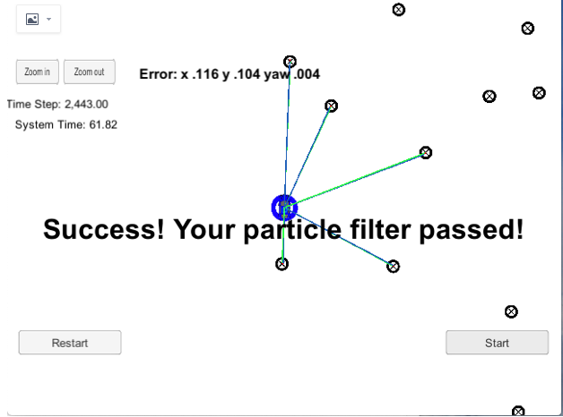

# Overview
This is the project for the Localization course in Udacity's Self-Driving Car Nanodegree.

## Project Introduction
One vehicle has been kidnapped and transported to a new location! Luckily it has a map of this location, a (noisy) GPS estimate of its initial location, and lots of (noisy) sensor and control data.

In this project I implemented a 2 dimensional particle filter in C++. The particle filter is given a map and some initial localization information (analogous to what a GPS would provide). At each time step the filter will also get observation and control data.

My particle filter is implemented in   
**[src/particle_filter.cpp](./src/particle_filter.cpp)**, and **[particle_filter.h](./src/particle_filter.h)**

## Running the code
I compliled the project on **MacOS 10.14.5 with g++-9**:  
g++-9 (Homebrew GCC 9.2.0_1)  9.2.0

I executed the following to build the project from the top directory  

1. ./clean.sh
2. ./build.sh
3. ./run.sh

The main program can also be built and ran by doing the following from the project top directory.

1. mkdir build
2. cd build
3. cmake ..
4. make
5. ./particle_filter

# Success Criteria

1. **Accuracy**: The particle filter can localize vehicle position and yaw to within the values specified in the parameters `max_translation_error` and `max_yaw_error` in `src/main.cpp`.

2. **Performance**: The particle filter can complete execution within the time of 100 seconds.

## My Running Result

# Environment Setup
The project involves the Term 2 Simulator which can be downloaded [here](https://github.com/udacity/self-driving-car-sim/releases)

